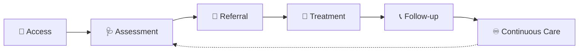
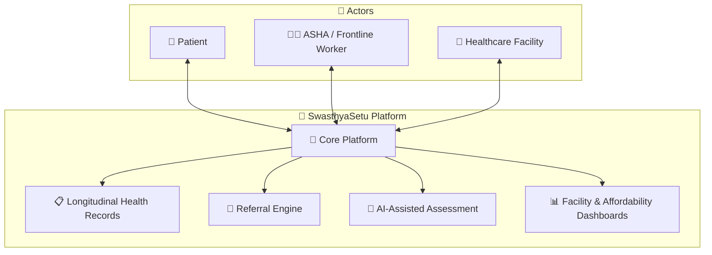

<div align="center">
<p align="center">
  
</p>

# 🩺 SwasthyaSetu

### *Connecting People • Healthcare • Continuous Care*

**Bridging the gap between Patients, Frontline Health Workers, and Healthcare Facilities**  
*for a healthier, more connected rural India.*

[]()
[]()
[]()
[]()

[🎥 Watch Demo](https://youtu.be/nFyw4Jtaioo) • [📖 Overview](#-overview) • [✨ Features](#-key-features) • [🏗️ Architecture](#️-system-architecture) • [👥 Team](#-team)

</div>

---

## 📖 Overview

**SwasthyaSetu** *(Setu = "Bridge")* is a digital healthcare support platform built for **Smart India Hackathon 2026**, designed to tackle one of India's most persistent challenges — **healthcare accessibility in rural and underserved communities**.

Instead of functioning as a single-purpose health app, SwasthyaSetu acts as a **connective layer** — linking patients, ASHA/frontline health workers, and healthcare facilities into one continuous, trackable healthcare journey. From first contact to long-term follow-up, no patient's story ends at the clinic door.

> 🌉 *"Healthcare shouldn't end at the clinic door. It should follow the patient home."*

---

## 🎯 Problem Statement

<table>
<tr><td><b>Problem Statement ID</b></td><td>SIH 26133</td></tr>
<tr><td><b>Theme</b></td><td>Accessibility and quality of public healthcare services, particularly in rural and underserved areas</td></tr>
<tr><td><b>Category</b></td><td>Software</td></tr>
</table>

Rural healthcare journeys are often **fragmented and one-way**: patients struggle to access timely care, frontline workers lack tools suited to low-connectivity realities, referrals between facilities go untracked, and follow-up care rarely happens. The result — delayed treatment, lost patients, and a healthcare system that treats visits as isolated events rather than a continuum of care.

---

## ❓ Why SwasthyaSetu?

| Challenge | SwasthyaSetu's Response |
|---|---|
| 📴 Poor/no internet connectivity in rural areas | Offline-first design that syncs when connectivity returns |
| 🧑‍⚕️ ASHA workers lack digital tooling in the field | Dedicated frontline worker support tools |
| 🗣️ Language & literacy barriers | Multilingual interface with voice assistance |
| 🔁 Untracked, informal referrals | Structured referral management between facilities |
| 📉 Care ends after a single visit | Longitudinal records + high-risk follow-up tracking |
| 💰 Unclear costs & affordability options | Dedicated affordability & payment dashboard |

---

## 💡 Our Solution

SwasthyaSetu digitizes the entire rural healthcare journey — turning disconnected touchpoints into one **continuous, trackable flow**:

```
  🚪 Access  →  🩺 Assessment  →  🔁 Referral  →  💊 Treatment  →  📞 Follow-up  →  ♾️ Continuous Care
```

Every patient interaction — from the first ASHA visit to long-term follow-up — stays connected within a single digital thread, giving patients, workers, and facilities a shared, up-to-date picture of care.

---

## ✨ Key Features

<table>
<tr><td>📴</td><td><b>Offline-First Healthcare Support</b></td><td>Built to function in low/no-connectivity environments, syncing data once online.</td></tr>
<tr><td>🧑‍⚕️</td><td><b>ASHA & Frontline Worker Support</b></td><td>Field-ready tools for recording, tracking, and managing patient interactions.</td></tr>
<tr><td>🗣️</td><td><b>Multilingual & Voice Assistance</b></td><td>Multiple language support with voice-based interaction for accessibility across literacy levels.</td></tr>
<tr><td>🤖</td><td><b>AI-Assisted Health Assessment</b></td><td>AI-assisted support for preliminary assessment to guide next steps — <i>not a diagnostic tool</i>.</td></tr>
<tr><td>📋</td><td><b>Longitudinal Digital Health Records</b></td><td>Persistent, patient-linked records that build over time instead of resetting each visit.</td></tr>
<tr><td>🔁</td><td><b>Referral Management</b></td><td>Structured, trackable referrals between healthcare facilities.</td></tr>
<tr><td>💊</td><td><b>Diagnostic & Medicine Availability</b></td><td>Visibility into diagnostics and medicine availability at connected facilities.</td></tr>
<tr><td>💰</td><td><b>Affordability & Payment Dashboard</b></td><td>Helps patients and workers navigate healthcare costs and payment options.</td></tr>
<tr><td>🆔</td><td><b>ABHA Access</b></td><td>Integration pathway with the Ayushman Bharat Health Account ecosystem.</td></tr>
<tr><td>⚠️</td><td><b>High-Risk Patient Follow-up</b></td><td>Flags and tracks high-risk patients to ensure continuity of care.</td></tr>
<tr><td>🏥</td><td><b>Facility Dashboard</b></td><td>Facility-side view for managing incoming patients, referrals, and case continuity.</td></tr>
<tr><td>👨‍👩‍👧</td><td><b>Caregiver Support Module</b> <i>(Planned)</i></td><td>Future module extending support to caregivers and family members.</td></tr>
</table>

> ⚕️ **Important:** All AI functionality in SwasthyaSetu is **assistive only** — it helps surface information and guide workflows, and does **not** provide medical diagnosis or replace clinical judgment.

---

## 🔄 Healthcare Workflow



Care doesn't stop at treatment — every patient is followed up with, and their journey continues to be tracked over time.

---

## 🏗️ System Architecture



*Architecture reflects the platform's conceptual structure and will evolve as implementation progresses.*

---

## 🛠️ Technology Stack

> ⚠️ *Technology stack will be documented here once finalized. Kept intentionally blank to avoid misrepresenting the current implementation.*

---

## 🎥 Project Video

<div align="center">

### [▶️ Watch the SwasthyaSetu Walkthrough](https://youtu.be/nFyw4Jtaioo)

</div>

---

## 🏆 Smart India Hackathon 2026

<table>
<tr><td><b>Hackathon</b></td><td>Smart India Hackathon 2026</td></tr>
<tr><td><b>Problem Statement ID</b></td><td>SIH 26133</td></tr>
<tr><td><b>Domain</b></td><td>Public Healthcare Accessibility</td></tr>
<tr><td><b>Focus Area</b></td><td>Rural & Underserved Communities</td></tr>
</table>

---

## 👥 Team

<div align="center">

| Name | Role |
|:---|:---|
| **Param Sheth** | 🧭 Team Lead & Management |
| **Sairaj Naik** | 💻 Developer |
| **Atharva Khamkar** | 💻 Developer |
| **Yutika Palav** | 💻 Developer |
| **Soham Rane** | 🎤 Designer & Presenter |
| **Tejas Patil** | 🎨 Creatives & UI/UX Designer |

</div>

---

## 🚀 Future Scope

- 👨‍👩‍👧 Full rollout of the **Caregiver Support Module**
- 🆔 Deeper **ABHA** and national health infrastructure integration
- 📴 Expanded offline-sync capabilities for remote regions
- 🗣️ Broader language and voice-assistance coverage
- 📊 Enhanced facility-level analytics for resource planning

---

## 📌 Project Status

> 🚧 **Prototype / In Development** — Being actively built for Smart India Hackathon 2026. Features above represent the intended scope; implementation status varies by module.

---

## 🌏 Vision

<div align="center">

**SwasthyaSetu** aims to be more than a healthcare app — it aims to be a **bridge** *("Setu")* between people and the care they deserve, making healthcare in rural and underserved India not just accessible, but **continuous, coordinated, and compassionate**.

---

*Built with purpose for Smart India Hackathon 2026* 🇮🇳

</div>
